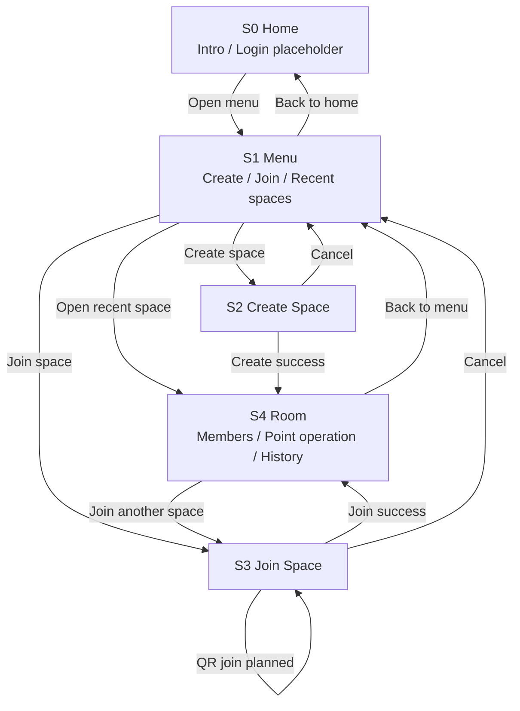

# Screen Flow

## Purpose

This document captures the current MVP screen transitions for the point management app.
It is written to be readable by both humans and AI tools.
The app is centered on guest-first participation, with account registration treated as a future extension.

## Current Design Scope

- Primary platform: Web
- Future client: Unity
- Primary usage modes: `owner` and `room`
- Primary user entry points: menu-based create flow, code-based guest join, recent-space reopen
- QR join accepts pasted payload text, shared join links, and room-generated QR codes; in-browser camera scanning is still pending
- Point operations and audit history are shown together in the room screen

## Screen List

### S0. Home

Purpose:
- Entry point for all users
- Explain the app briefly
- Reserve space for future login or account actions

Main actions:
- Open menu
- See login placeholder

### S1. Menu

Purpose:
- Branch users into the correct next action

Main actions:
- Go to create space
- Go to join space
- Reopen a recent space

### S2. Create Space

Purpose:
- Create either an `owner` or `room` type space
- Persist the space when the user confirms creation

Main actions:
- Choose mode
- Set space name
- Set visibility
- Set initial points
- Allow guest join
- Allow BANK minting when mode is `owner`
- Enter host display name
- Create the space

### S3. Join Space

Purpose:
- Let unregistered users join quickly using a shareable code

Main actions:
- Enter space code
- Enter display name
- Use QR join in the future
- Continue to room

### S4. Room

Purpose:
- Main operating screen after entry
- Show current room state, point operations, and append-only history together

Main actions:
- View room summary and members
- Execute `grant`, `transfer`, and `consume`
- Review transaction history
- Refresh history manually
- Return to menu or join another room

## MVP Transition Diagram

## Alternate View By Primary User Flow

### Flow A: Space owner starts a new event

1. `S0 Home`
2. `S1 Menu`
3. `S2 Create Space`
4. `S4 Room`

### Flow B: Guest joins an existing space

1. `S0 Home`
2. `S1 Menu`
3. `S3 Join Space`
4. `S4 Room`

### Flow C: Existing room is reopened

1. `S0 Home`
2. `S1 Menu`
3. Open recent space
4. `S4 Room`

## Screen Responsibilities

| Screen | Primary Responsibility | Secondary Responsibility |
| --- | --- | --- |
| S0 Home | Entry and explanation | Reserve login entry point |
| S1 Menu | Action branching | Reopen recent spaces |
| S2 Create Space | Initial room configuration | Create DB record |
| S3 Join Space | Fast participation by code | Future QR bridge |
| S4 Room | Operate points and inspect history | Return navigation |

## Implementation Notes

- `web/src/App.tsx` now uses `home`, `menu`, `create`, `join`, and `room` screen states.
- The old dashboard-style create form has been moved out of the room screen into `S2 Create Space`.
- `S3 Join Space` uses the existing `POST /api/spaces/join` endpoint and can normalize raw space codes or pasted QR payload strings into the `space code` field.
- `S4 Room` currently keeps point operation and history on the same page for MVP speed.
- `S4 Room` exposes both a share link and an in-app generated QR code that are consumed by `S3 Join Space`.
- `web/src/app/AppShell.tsx` should remain an orchestration layer for screen selection and shared state; API calls, transaction formatting, and other reusable logic should be split into sibling modules.
- Use `screens`, `hooks`, `services`, and `formatters` as the first split boundaries before creating deeper folder nesting.
- A single screen file can exceed the normal line target when it is mostly markup, but interaction logic should still move out once the file starts mixing state, network access, and formatting rules.

## Suggested Next Build Order

1. Add guest re-entry token handling
2. Split `S4 Room` into tabs only if the single-screen layout becomes too dense
3. Add login and account linking entry from `S0 Home`
4. Add in-browser camera scanning on top of the QR payload flow
