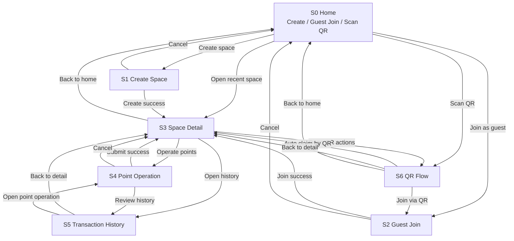

# Screen Flow

## Purpose

This document captures the current MVP screen transitions for the point management app.
It is written to be readable by both humans and AI tools.
The app is centered on guest-first participation, with account registration treated as a secondary flow.

## Current Design Scope

- Primary platform: Web
- Future client: Unity
- Primary usage modes: `owner` and `room`
- Primary user entry points: create a space, join as guest, join via QR
- Audit and point operations are append-only and visible from the space detail flow

## Screen List

### S0. Home

Purpose:
- Entry point for all users
- Explain the app briefly
- Offer the three main actions

Main actions:
- Create space
- Join as guest
- Scan QR
- Reopen recent space

### S1. Create Space

Purpose:
- Create either an `owner` or `room` type space

Main actions:
- Choose mode
- Set initial points
- Set visibility
- Allow guest join
- Allow BANK minting when mode is `owner`
- Create the space

### S2. Guest Join

Purpose:
- Let unregistered users join quickly

Main actions:
- Enter space code
- Enter display name
- Re-enter using stored token in the future
- Continue to space detail

### S3. Space Detail

Purpose:
- Main operating screen after entry
- Show current state of a space

Main actions:
- View members and current points
- Open point operation flow
- Open transaction history
- Refresh ranking manually
- Open QR flow

### S4. Point Operation

Purpose:
- Execute `grant`, `transfer`, or `consume`

Main actions:
- Choose transaction type
- Choose actor type: `member`, `system`, `qr`
- Choose actor member when actor type is `member`
- Choose source member when needed
- Choose target member when needed
- Enter amount and note
- Submit transaction

### S5. Transaction History

Purpose:
- Audit append-only ledger entries

Main actions:
- View latest transactions first
- Review actor, source, target, amount, note, timestamp
- Refresh history manually

### S6. QR Flow

Purpose:
- Handle QR-based participation and point receipt

Main actions:
- Show join QR
- Show reward QR
- Scan QR
- Route to guest creation, re-entry, or automatic point claim

## MVP Transition Diagram

## Alternate View By Primary User Flow

### Flow A: Space owner starts a new event

1. `S0 Home`
2. `S1 Create Space`
3. `S3 Space Detail`
4. `S4 Point Operation`
5. `S5 Transaction History`

### Flow B: Guest joins an existing space

1. `S0 Home`
2. `S2 Guest Join`
3. `S3 Space Detail`
4. `S4 Point Operation` if permitted
5. `S5 Transaction History`

### Flow C: QR-based entry or reward

1. `S0 Home` or external QR scan
2. `S6 QR Flow`
3. `S2 Guest Join` when user identity is needed
4. `S3 Space Detail`

## Screen Responsibilities

| Screen | Primary Responsibility | Secondary Responsibility |
| --- | --- | --- |
| S0 Home | Entry and routing | Explain product value |
| S1 Create Space | Initial configuration | Mode selection |
| S2 Guest Join | Fast participation | Re-entry |
| S3 Space Detail | Main operational view | Navigation hub |
| S4 Point Operation | Execute point changes | Validation before submission |
| S5 Transaction History | Audit trail | Manual refresh |
| S6 QR Flow | QR-based join and claim | Bridge to future QR APIs |

## Implementation Notes

- `S3 Space Detail`, `S4 Point Operation`, and `S5 Transaction History` already have partial implementation in the current Web client.
- `S0 Home` and `S2 Guest Join` are the next natural Web screens to add.
- `S6 QR Flow` should stay lightweight at first and can initially act as a placeholder screen with clear routing.
- Registration screens are intentionally excluded from the MVP primary flow.

## Suggested Next Build Order

1. Add `S0 Home`
2. Add `S2 Guest Join`
3. Refine `S3 Space Detail`
4. Refine `S4 Point Operation`
5. Refine `S5 Transaction History`
6. Add `S6 QR Flow`
